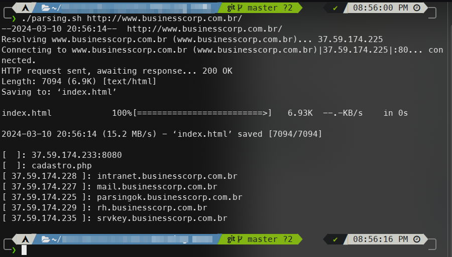

# HTML HREF Lookup Documentation
This script is written in Bash and is used to parse an HTML file, extract URLs from the href attributes in the body section, perform a DNS lookup on each URL, and save the results to an output file.

## Usage

```shell
./parsing.sh [TARGET_URL]
```
Replace `[TARGET_URL]` with the URL of the HTML file you want to parse.

## Variables
- `DEFAULT_OUTPUT_FILE`: The default path for the output file.
- `DEFAULT_INDEX_FILE`: The default name for the index file.
- `TEMP_FOLDER_NAME`: The name of the temporary folder used during the script's execution.
- `TARGET_URL`: The URL of the HTML file to parse.
## Functions
- `filter_href_html`: This function filters the href attributes from the HTML body section.
## Workflow
1. The script creates a temporary folder and navigates into it.
2. It downloads the HTML file from the target URL.
3. It extracts URLs from the HTML file, performs a DNS lookup on each URL, and saves the results to an array.
4. The array of results is saved to the output file.
5. The script navigates back to the parent directory and removes the temporary folder.

## Output

The script outputs a list of URLs found in the HTML file, along with the results of a DNS lookup for each URL. This output is saved to the output file specified by ``DEFAULT_OUTPUT_FILE``.

## Error Handling
If the script fails to create the temporary folder or navigate into it, it will exit with a status code of 1.
